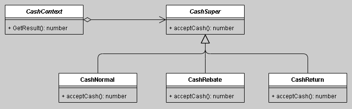
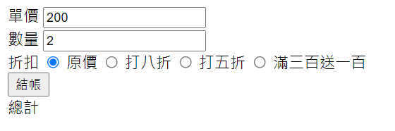

# 策略模式-商場促銷
*將不同策略各自進行封裝, 讓這些策略在使用上便於相互替換; 因為這些策略具有類似的特性, 可演化出抽象類別, 最後再用工廠來實體化真正要使用到的策略*

## 依下面UML圖, 實作商場促銷收銀程式


- 前端畫面/程式碼<br>

```html
<head>
    <script src="http://ajax.googleapis.com/ajax/libs/jquery/3.4.0/jquery.min.js"></script>
    <script src="/src/test.js"></script>
</head>

<body>
    <label>單價</label>
    <input type="text" id="i_price" value="200">
    <br>
    <label>數量</label>
    <input type="text" id="i_amount" value="2">
    <br>
    <label>折扣</label>
    <input type="radio" id="rb_normal_price" name="rb_discount_list" value="dc_normal_price" checked="true">
    <label for="rb_dc_20percent_off">原價</label>
    <input type="radio" id="rb_dc_20percent_off" name="rb_discount_list" value="dc_20percent_off">
    <label for="rb_dc_20percent_off">打八折</label>
    <input type="radio" id="rb_dc_50percent_off" name="rb_discount_list" value="dc_50percent_off">
    <label for="rb_dc_50percent_off">打五折</label>
    <input type="radio" id="rb_dc_300_return_100" name="rb_discount_list" value="dc_300_return_100">
    <label for="rb_dc_50percent_off">滿三百送一百</label>
    <br>
    <input type="button" id="btn_canculate" value="結帳">
    <br>
    <label>總計</label>
    <label id="lb_total" style="background-color:yellow"></label>
</body>
```
- 後端
```javascript
window.onload = function() {
    //[結帳]
    $('#btn_canculate').on('click', function() { CalculatePriceAndShow(); });
    //[折扣]
    $('[name=rb_discount_list]').on('change', function() {
        console.log('選擇的是[' + $('[name=rb_discount_list]:checked').val() + ']');
        CalculatePriceAndShow();
    });
};

var CalculatePriceAndShow = function() {
    let totalPrice = $('#i_price').val() * $('#i_amount').val();
    let discountStrategy = $('[name=rb_discount_list]:checked').val();
    $('#lb_total').html((new CashContext(discountStrategy)).GetResult(totalPrice));
}

/**策略工廠 */
class CashContext {
    constructor(p_type) {
        switch (p_type) {
            case 'normal_price': //原價
                this.cs = new CashNormal();
                break;
            case 'dc_20percent_off': //打八折
                this.cs = new CashRebate(0.8);
                break;
            case 'dc_50percent_off': //打五折
                this.cs = new CashRebate(0.5);
                break;
            case 'dc_300_return_100': //滿三百送一百
                this.cs = new CashReturn(300, 100);
                break;
            default:
                this.cs = new CashNormal();
        }
    }
    GetResult(p_money) {
        return this.cs.acceptCash(p_money);
    }
};

/**抽象策略類別 */
class CashSuper {
    constructor() {}
    acceptCash(p_oriMoney) {}
};
/**策略實作 */
class CashNormal extends CashSuper {
    constructor() {
        super();
    }
    acceptCash(p_oriMoney) { return p_oriMoney; }
}
class CashRebate extends CashSuper {
    constructor(p_moneyRebate) {
        super();
        this.moneyRebate = p_moneyRebate || 1; //預設無折扣
    }
    acceptCash(p_oriMoney) {
        return p_oriMoney * this.moneyRebate;
    }
}
class CashReturn extends CashSuper {
    constructor(p_moneyReturnDiv, p_moneyReturn) {
        super();
        this.moneyReturnDiv = p_moneyReturnDiv;
        this.moneyReturn = p_moneyReturn;
    }
    acceptCash(p_oriMoney) {
        let divCount = Math.floor(p_oriMoney / this.moneyReturnDiv);
        return p_oriMoney - this.moneyReturn * divCount;
    }
}
```
- 執行結果<br>
