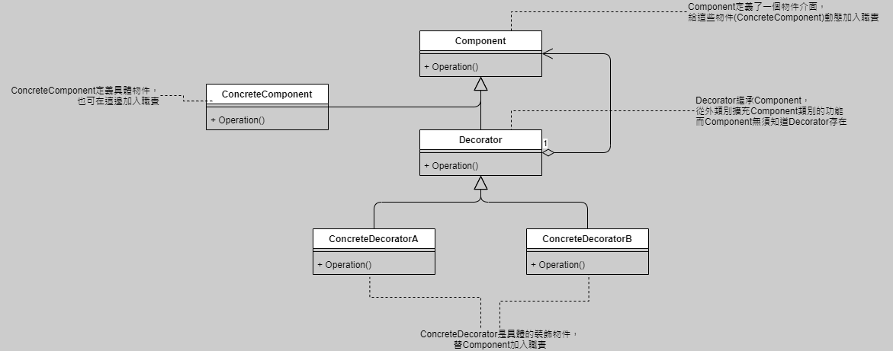
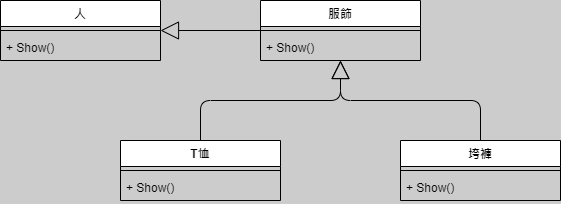
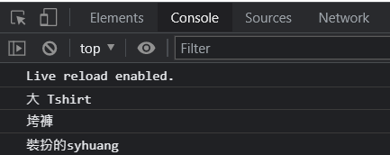

# 裝飾者模式-穿衣
*動態給物件加入職責*

*`裝飾類別基本實現 p.75`*

## 實現以下UML


- 前端畫面/程式碼

```javascript
window.onload = function() {
    let xc = new Person('syhuang');

    kk = new BigTrouser();
    dtx = new TShirts();

    kk.Decorate(xc);
    dtx.Decorate(kk);
    dtx.Show();
}

/**Concrete Component */
class Person {
    constructor(p_name) {
        this.name = p_name;
    }
    Show() {
        console.log(`裝扮的${this.name}`);
    }
}

/**Decorator */
class Finery extends Person {
    constructor() {
        super();
    }
    Decorate(p_comp) {
        this.comp = p_comp;
    }
    Show() {
        if (!this.comp) this.comp.Show();
    }
}

/**Concrete Decorator 1 */
class TShirts extends Finery {
    constructor() {
        super();
    }
    Show() {
        console.log('大 Tshirt');
        this.comp.Show();
    }
}

/**Concrete Decorator 2 */
class BigTrouser extends Finery {
    constructor() {
        super();
    }
    Show() {
        console.log('垮褲');
        this.comp.Show();
    }
}
```

## 總結
- 裝飾模式為既有功能動態加入更多功能
- 把裝飾功能從類別去除，就能簡化原有類別
- 有效地把類別的核心職責和裝飾功能分開
- 裝飾模式的裝飾順序很重要，最好保持裝飾類別之間彼此獨立，這樣就能無關順序進行裝飾