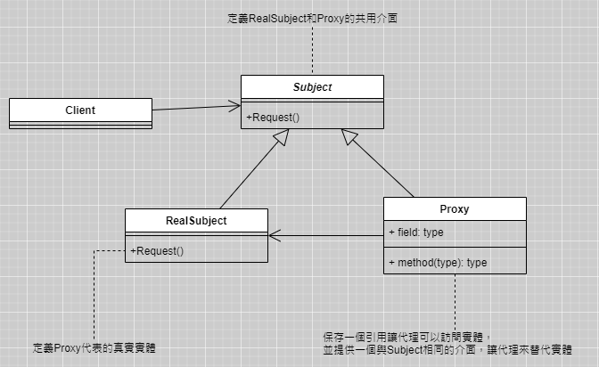
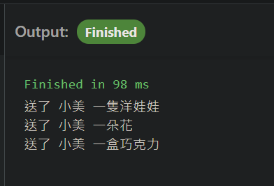

# 代理模式-送禮
**

*`基本實現 p.96`*

## 實現以下UML


- 前端畫面/程式碼
- 
```javascript
/**定義共用介面 */
class GiveGift {
    GiveDolls() {}
    GiveFlowers() {}
    GiveChocolate() {}
}
/**追求者實體 */
class Pursuit extends GiveGift {
    constructor(p_mm) {
        super();
        this.mm = p_mm;
    }
    GiveDolls() {
        console.log('送了 ' + this.mm.Name + ' 一隻洋娃娃');
    }
    GiveFlowers() {
        console.log('送了 ' + this.mm.Name + ' 一朵花');
    }
    GiveChocolate() {
        console.log('送了 ' + this.mm.Name + ' 一盒巧克力');
    }
}
/**代理 */
class Proxy extends GiveGift {
    constructor(p_mm) {
        super();
        this.proxy = new Pursuit(p_mm);
    }
    GiveDolls() {
        this.proxy.GiveDolls();
    }
    GiveFlowers() {
        this.proxy.GiveFlowers();
    }
    GiveChocolate() {
        this.proxy.GiveChocolate();
    }

}

(function main() {
    let schoolGirl = {};
    schoolGirl.Name = '小美';
    let p = new Proxy(schoolGirl);

    p.GiveDolls();
    p.GiveFlowers();
    p.GiveChocolate();
}());
```
## 應用
- 遠端代理: 為一個物件在不同的位址提供代表，可以隱藏一個物件存在不同位址的事實
- 虛擬代理: 透過代理來存放消耗大的物件,真正需要時才建立<br>
*`ex.網頁載入時, 圖片並沒有在一開始就全數下載完畢, 而是瀏覽到該區域, 才下載該區的圖片`*
- 安全代理: 控制真實物件存取時的權限
- 智慧參考: 調用真實物件時, 代理處理一些事<br>
*`ex.計算參考次數`*