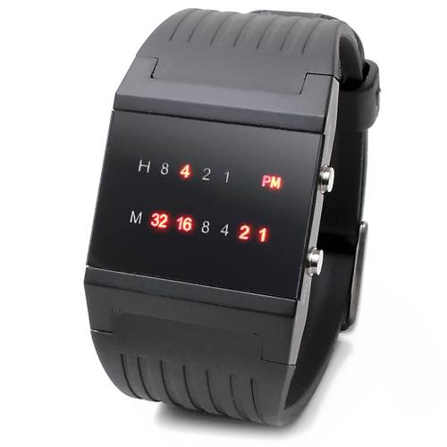

# \#401 Binary Watch
## *已知有一binary watch如下圖:*

## *特性:*
 - 燈號為二進位的其中一位數為1轉換成十進位來表示數字
 - H=小時，M=分鐘，亮燈數字的加總就是目前的時間
 - 例如圖上H的4亮燈，表示小時為4；M的32/16/2/1亮燈表示分鐘為32+16+2+1=51分鐘，因此時間為4:51
## *現在給定一數字turnedOn表示燈號亮的個數, 回傳所有可能的時間組合(字串陣列形式)*
## Log
 - build 20210724 by syhuang

## 反向思考: 從所有時間回推亮的燈號數
 - 跑兩層迴圈(一層小時,一層分鐘)取得所有時間, 判斷該時間亮起的燈號數是不是符合要求
 - javascript搭配[#191](articles/Leetcode/easy/191.md)計算二進位數字中"1"的出現次數
```javascript=
var readBinaryWatch = function(turnedOn) {
    let result = [];
    for(let h=0; h<12; h++){
        for(let m=0; m<60; m++){
            if(hammingWeight(h)+hammingWeight(m) == turnedOn) result.push(h+':'+m.toString().padStart(2,'0'));
        }
    }
    return result;
    
    function hammingWeight(n) {
        var result=0;
        while(n){
            if(parseInt(n&1)) result++;
            n>>>=1;
        }
        return result;
    };
};
```
## 初見
 - 燈號總共有4+6=10個, 用數學的排列組合中的$C^n_m$, n=10, m=trunedOn, 即可取得所有可能的時間組合
 - 等有時間再來實作
```javascript=
```
## 備註
## 參考
- [关于组合算法的 JS 实现](http://jimyuan.github.io/blog/2019/04/03/combination-algorithm-with-js.html)
- [參考解](https://leetcode.com/problems/binary-watch/discuss/88458/Simple-Python%2BJava)
###### tags: `leetcode`, `leetcode-easy`