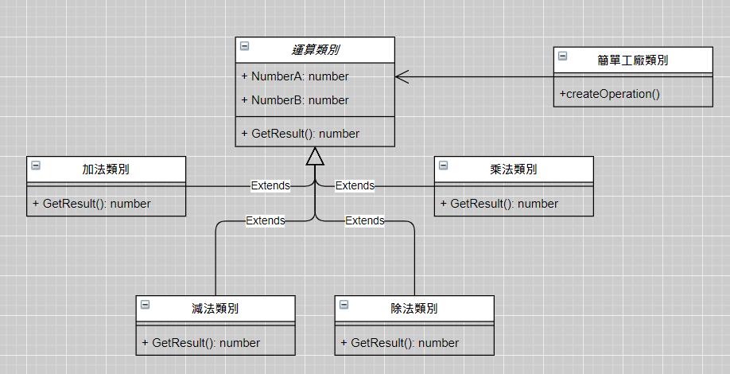
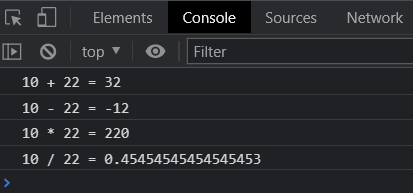

# 簡單工廠模式
## 用一個工廠類別作為邏輯實作的業務端, 根據傳入的參數不同, 實體化相應的物件並回傳給客戶端使用
### 依照以下UML圖, 實作運算類別

```javascript=
window.onload = function() {
    let a = 10,
        b = 22;
    let operator;
    let operateObj;

    operator = '+';
    operateObj = OperationFactory.CreateOperate(operator);
    operateObj.NUMBERA = a;
    operateObj.NUMBERB = b;
    console.log(`${a} ${operator} ${b} = ${operateObj.GetResult()}`);

    operator = '-';
    operateObj = OperationFactory.CreateOperate(operator);
    operateObj.NUMBERA = a;
    operateObj.NUMBERB = b;
    console.log(`${a} ${operator} ${b} = ${operateObj.GetResult()}`);

    operator = '*';
    operateObj = OperationFactory.CreateOperate(operator);
    operateObj.NUMBERA = a;
    operateObj.NUMBERB = b;
    console.log(`${a} ${operator} ${b} = ${operateObj.GetResult()}`);

    operator = '/';
    operateObj = OperationFactory.CreateOperate(operator);
    operateObj.NUMBERA = a;
    operateObj.NUMBERB = b;
    console.log(`${a} ${operator} ${b} = ${operateObj.GetResult()}`);
};
/**簡單工廠類別 */
class OperationFactory {
    static CreateOperate(p_operator) {
        let result;
        switch (p_operator) {
            case '+':
                result = new OperationAdd();
                break;
            case '-':
                result = new OperationSub();
                break;
            case '*':
                result = new OperationMul();
                break;
            case '/':
                result = new OperationDiv();
                break;
        }
        return result;
    }
};
/**運算類別 */
class Operation {
    constructor() {
        this.NUMBERA = 0;
        this.NUMBERB = 0;
    }
    GetResult() {
        return 0;
    }
}
/**加法類別 */
class OperationAdd extends Operation {
    GetResult() {
        return this.NUMBERA + this.NUMBERB;
    }
}
/**減法類別 */
class OperationSub extends Operation {
    GetResult() {
        return this.NUMBERA - this.NUMBERB;
    }
}
/**乘法類別 */
class OperationMul extends Operation {
    GetResult() {
        return this.NUMBERA * this.NUMBERB;
    }
}
/**除法類別 */
class OperationDiv extends Operation {
    GetResult() {
        if (this.NUMBERB === 0) throw new Error('除數不可為零');
        return this.NUMBERA / this.NUMBERB;
    }
}
```
執行結果:<br>
