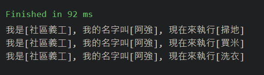

# 工廠方法模式
*定義一個用於建立物件的介面，讓子類別決定實體化哪個類別。工廠方法使一個類別的實例化延遲到其子類別*


## 實現南丁格爾工廠
- 程式碼&執行結果
<br>
```javascript
//Product: 南丁格爾類別
class Nightingale{
    constructor(){
        this.type = '';
        this.name = '';
    }
    Sweep(){
        console.log(`我是[${this.type}], 我的名字叫[${this.name}], 現在來執行[掃地]`);
    }
    Wash(){
        console.log(`我是[${this.type}], 我的名字叫[${this.name}], 現在來執行[洗衣]`);
    }
    BuyRice(){
        console.log(`我是[${this.type}], 我的名字叫[${this.name}], 現在來執行[買米]`);
    }
}

//Concrete Product 2: 社區義工
class Volunteer extends Nightingale{
    constructor(p_name){
        super();
        this.type = '社區義工';
        this.name = p_name;
    }
}

//Concrete Product 1: 學南丁格爾的大學生
class Undergraduate extends Nightingale{
    constructor(p_name){
        super();
        this.type = '大學生';
        this.name = p_name;
    }
}

//Creator: 南丁格爾工廠
class IFactory{
    constructor(){
        this.name = '';
    }
    static CreateNightingale(){}
}

//ConcreteCreator 1: 學南丁格爾的大學生工廠
class UndergraduateFactory extends IFactory{
    constructor(){super();}
    CreateNightingale(p_name){
        this.name = p_name;
        return new Undergraduate(this.name);
    }
}

//ConcreteCreator 2: 社區義工工廠
class VolunteerFactory extends IFactory{
    constructor(){super();}
    CreateNightingale(p_name){
        this.name = p_name;
        return new Volunteer(this.name);
    }
}

(function main() {
    //當要替換[大學生]或是[社區義工]時, 只要下面兩行程式碼擇一做宣告即可
    //let myFactory = new UndergraduateFactory();//[大學生]
    let myFactory = new VolunteerFactory();//[社區義工]
    let helper = myFactory.CreateNightingale('阿強');
    helper.Sweep();
    helper.BuyRice();
    helper.Wash();
}());
```
