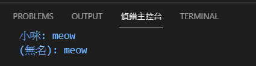
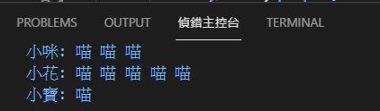
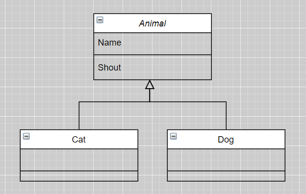
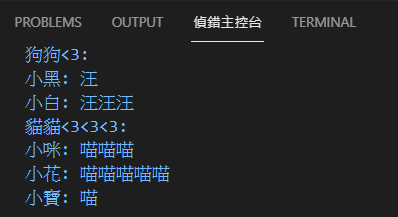
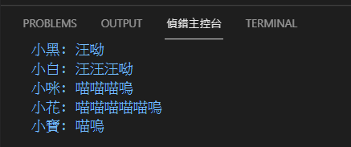

# A2-A4 類別, 實體, 建構式, 重載(overload)
## *寫一個Cat類別, 內含屬性:name(可給定名字, 或預設"無名")與方法:shout(), 把它實體化並呼叫shout()*
```javascript
window.onload = function() {
    var myCat = new Cat('小咪');
    var myCatWithoutName = new Cat();
    myCat.shout();
    myCatWithoutName.shout();
}
class Cat {
    constructor(p_name) {
        this.name = p_name || '(無名)';
    }
    shout() {
        console.log(this.name + ': meow');
    }
}
```
執行結果:<br>

> javascript沒有原生的overload可以使用, 只能透過判斷傳遞的參數(ex.是否undefined, typeof()..等<br>[參考](https://stackoverflow.com/questions/10855908/how-to-overload-functions-in-javascript)

# A5 Get與Set
## 將Cat類別加一個_SHOUT_NUM屬性, 可以透過SHOUT_NUM設定shout()要叫幾次(不設定的話只叫1次), 最高叫5次
```javascript
window.onload = function() {
    let myCat1 = new Cat('小咪');
    let myCat2 = new Cat('小花');
    let myCat3 = new Cat('小寶');
    myCat1.SHOUT_NUM = 3;
    myCat2.SHOUT_NUM = 10;
    myCat1.Shout();
    myCat2.Shout();
    myCat3.Shout();
}
class Cat {
    constructor(p_name) {
        this.NAME = p_name || '(無名)';
        this.VOICE = '喵';
        this._MAX_SHOUT_NUM = 5;
        this._SHOUT_NUM = 1;
    }
    get SHOUT_NUM() { return this._SHOUT_NUM; }
    set SHOUT_NUM(p_num) {
        this._SHOUT_NUM = p_num > this._MAX_SHOUT_NUM ? this._MAX_SHOUT_NUM : p_num;
    };
    Shout() {
        let s = '';
        for (let i = 0; i < this._SHOUT_NUM; i++) s += this.VOICE + ' ';
        console.log(`${this.NAME}: ${s}`);
    };
}
```
執行結果:<br>

> javascript不支援private/public概念, 只能透過變數名稱前面加底線"_"作為區分公有or私有, 實際上就是宣告兩個不同變數了

# A6, A7 封裝&繼承
## 實做以下class:

- class: Animal/Cat/Dog
- Animal有屬性Name和方法Shout
- Cat與Dog繼承Animal
- Cat叫聲為"喵", 最多叫5聲; Dog叫聲為"汪", 最多叫3聲; 預設都是叫1聲
```javascript
window.onload = function() {
    let Animals = [];
    //狗狗
    let myDog1 = new Dog('小黑');
    let myDog2 = new Dog('小白');
    myDog1.SHOUT_NUM = 1;
    myDog2.SHOUT_NUM = 5;
    Animals.push(myDog1);
    Animals.push(myDog2);
    //貓貓
    let myCat1 = new Cat('小咪');
    let myCat2 = new Cat('小花');
    let myCat3 = new Cat('小寶');
    myCat1.SHOUT_NUM = 3;
    myCat2.SHOUT_NUM = 10;
    Animals.push(myCat1);
    Animals.push(myCat2);
    Animals.push(myCat3);
    //輸出
    for (animal of Animals) animal.Shout();
}
class Animal {
    constructor(p_name, p_max_shout_num, p_voice) {
        this.NAME = p_name || '(無名)';
        this._MAX_SHOUT_NUM = p_max_shout_num;
        this._SHOUT_NUM = 1;
        this._VOICE = p_voice;
    }
    get SHOUT_NUM() { return this._SHOUT_NUM; }
    set SHOUT_NUM(p_num) {
        this._SHOUT_NUM = p_num > this._MAX_SHOUT_NUM ? this._MAX_SHOUT_NUM : p_num;
    };
    Shout() {
        console.log(`${this.NAME}: ${this.GetShout(this.SHOUT_NUM)}`);
    }
    GetShout(p_count) {
        let result = '';
        for (let i = 0; i < p_count; i++) result += this._VOICE;
        return result;
    }
}
class Dog extends Animal {
    constructor(p_name) {
        super(p_name, 3, '汪');
    }
}
class Cat extends Animal {
    constructor(p_name) {
        super(p_name, 5, '喵');
    }
}
```
執行結果:<br>

> 繼承減少了重複的程式碼, 也增強了耦合性

# A8 多型(override)
## 承接上個主題, Cat與Dog的叫聲最後各加上"嗚"和"呦"
```javascript
//class Dog和Cat加入GetShout()方法把Animal原本的方法覆寫掉
GetShout(p_count) {
    let result = '';
    for (let i = 0; i < p_count; i++) result += this._VOICE;
    return result + '呦';//Cat類別改成"嗚"
}
```
執行結果:<br>
