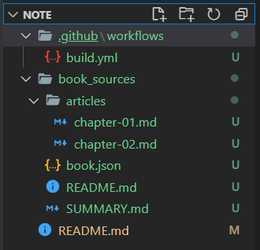

# 建立gitbook, 並可在VSCode與HackMD編輯推送至GitHub
## Log
  - 20210327 建立 by syhuang
## GitHub網站
 - 建立存放庫
 - 建立`GitHub Personal Access Token`: (右上個人圖像)`Settings` > ` Developer settings` > `Personal access tokens` > `Generate new token`, 勾選`[repo:status]`和`[public_repo]`後Generate token

    此時會產生一組token, 複製下來(只會顯示在頁面一次)

 - 回到存放庫的`Settings` > `Secrets` > `New respoitory secret`, `[Name]`填自訂的名稱, `[Value]`填前一步驟複製的token, Add secret

    <br>*`[Name]`自訂的名稱記下來,待會用到*
 - 將存放庫下載到本機(ex.用github desktop來clone存放庫), 並確認可以使用VSCode進行推送(push)
## VS Code
 - 搭配[gitbook_templete](file/gitbook_templete.zip), 將本機存放庫的目錄/檔案結構調整為

<br>
在VS Code的資料夾結構
<br>

<br>
*`README.md`和`SUMMARY.md`是必要檔案, 其他可依照個人習慣建立資料夾/檔案*
 - 設定`book.json`內容
    ```json
    {
        "plugins": [  "anchor-navigation-ex", "edit-link", "copy-code-button", "theme-comscore", "ga" ],
        "pluginsConfig": {
        "fontSettings": {
            "theme": "night",
            "family": "sans"
        },
        "theme-default": {
            "showLevel": false
        },
        "anchor-navigation-ex": {
            "showLevel": false,
            "associatedWithSummary": false,
            "printLog": false,
            "multipleH1": false,
            "mode": "float",
            "showGoTop":true,
            "float": {
                "floatIcon": "fa fa-navicon",
                "showLevelIcon": false,
                "level1Icon": "fa fa-hand-o-right",
                "level2Icon": "fa fa-hand-o-right",
                "level3Icon": "fa fa-hand-o-right"
            },
            "pageTop": {
                "showLevelIcon": false,
                "level1Icon": "fa fa-hand-o-right",
                "level2Icon": "fa fa-hand-o-right",
                "level3Icon": "fa fa-hand-o-right"
            }
        },
        "edit-link": {
            "base": "https://github.com/<GitHub user name>/<存放庫名稱>/edit/<branche名稱>/book_sources/",
            "label": "編輯"
        },
        "ga": {
            "token": ""
        }
        }
    }
    ```
 - 設定`build.yml`內容
```yaml
name: Build my gitbook and deploy to gh-pages

on:
  workflow_dispatch:
  push:
    branches:
      - < branch名稱 >

jobs:
  build-and-deploy:
    name: Build and deploy
    runs-on: ubuntu-latest
    env:
      MY_SECRET   : ${{secrets.<前面步驟設定的自訂token name>}}
      USER_NAME   : <你的github user name>
      USER_EMAIL  : <你的github email>
      BOOK_DIR    : book_sources

    steps:
    - name: Checkout 🛎️
      uses: actions/checkout@v2.3.1
    - name: Build and Deploy 🚀
      uses: onejar99/gitbook-build-publish-action@v1.0.0
```
 - 認可(commit)並推送(push)存放庫
## GitHub網站
 - 回到存放庫, 在`Actions`可以看到commit後的結果會由`build.yml`自動產生gitbook

 - run完後, 到`Code` > `github-pages` > 點選`[View deployment]`, 即可看到自動產生的gitbook


## 在HackMD編輯或新增筆記, 並同步到GitHub
 - 編輯存放庫中原有的筆記: 建立筆記後, 在選項 > 版本與GitHub同步 > 從GitHub拉取, 往後編輯完再推送至GitHub

 - 新增筆記並推送到GitHub存放庫: 建立筆記後, 在選項 > 版本與GitHub同步 > 推送至GitHub

## 在HackMD的筆記, 預設編輯權限是`所有登入者`, 記得修改為`擁有者`


## 備註
 - 檔案命名含有`#`字元, 在建立gitbook時會出錯

## 參考
 - https://www.onejar99.com/gitbook-building-and-publishing-free-unlimitedly/
 - https://hackmd.io/